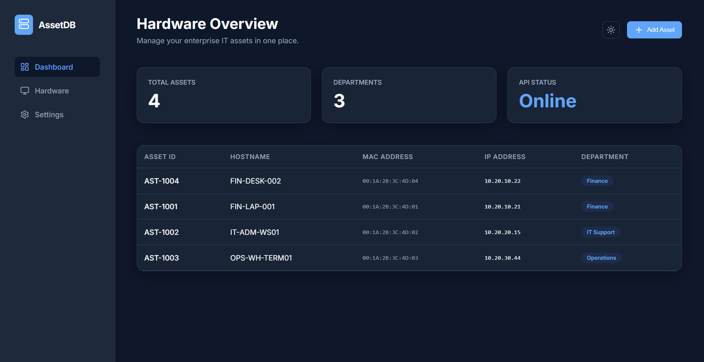
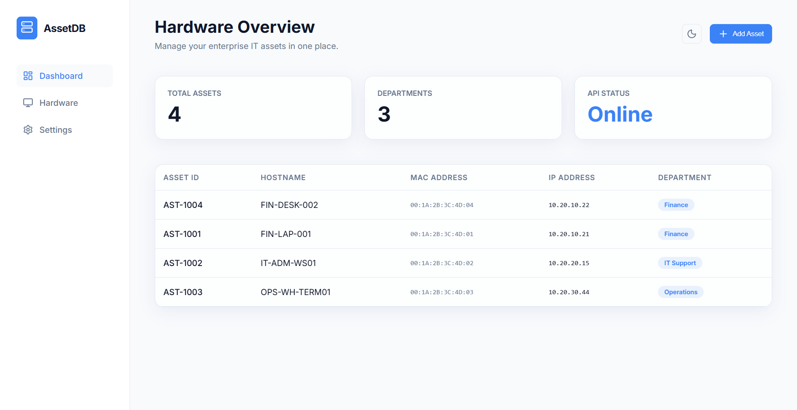

# IT Asset DB - React Dashboard

This is the modern, responsive React (Vite) frontend dashboard built to consume the [IT Asset DB API](https://github.com/stokie2605/it-asset-db-api). 

## 📸 Dashboard Preview




## 🚀 The Architecture
This frontend perfectly complements the FastAPI backend, demonstrating a complete **Full-Stack Microservices Architecture**:
- **Frontend:** React + Vite + Vanilla CSS (Glassmorphism & Theming)
- **Backend:** FastAPI + Python
- **Database:** SQLite (Containerized)

## ✨ Features
- **Live Data Fetching:** Automatically retrieves hardware assets from the API.
- **Dynamic Theming:** Seamless Light/Dark mode toggling using native CSS variables.
- **Premium UI:** Custom glassmorphism design, SVG iconography via `lucide-react`, and micro-animations.
- **Form Integration:** "Add Asset" modal that sends `POST` requests to the backend and instantly updates the UI state.

## 💻 Local Setup
1. Ensure your backend Docker container is running (`docker-compose up`).
2. Clone this repository.
3. Install dependencies:
   ```bash
   npm install
   ```
4. Run the development server:
   ```bash
   npm run dev
   ```
5. Open your browser to `http://localhost:5173`.
